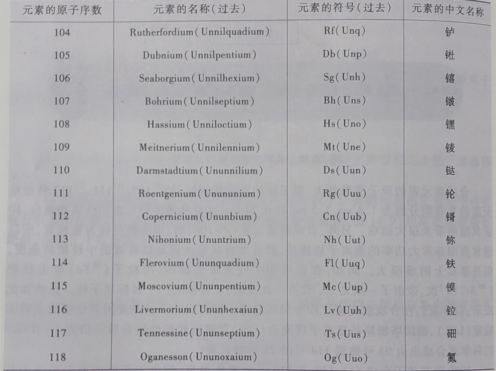

<link  rel="stylesheet" type="text/css" href="1.css">

<!--
style:
-->

# 放射性衰变和应用

## 放射性衰变

- 天然放射性是指，不稳定原子核自发地放出
- $\alpha$、$\beta$、$\gamma$射线的现象。
- 大量的同种原子核因放射性而陆续发生转变，使处于原状态的核数目不断减少的过程称为<b>放射性衰变</b>
- 常见的衰变有以下三种：
  - $\alpha$衰变
  - $\beta^-$衰变
  - $\gamma$衰变

---------

## 放射性衰变和应用

### $\alpha$衰变

不稳定的原子核自发放射出
$\alpha$
射线的过程，称为
$\alpha$
衰变

$\alpha$
射线是
$\alpha$
粒子（
$^4_2He$
氦核）流。

当天然铀质量数为238的核素（简写为铀~238）失去一个
$\alpha$
粒子时，剩下的是原子序数90和质量数为234的钍核，即
$^{234}_{90}Th$
，其核反应方程式如下：

$$\rm ^{238}_{92}U\longrightarrow^{234}_{90}Th+^4_2He$$

在上述核反应中，方程式两边质量数相等，原子序数之和或和电荷数也相等。

----------

## 放射性衰变和应用

### $\beta^-$衰变

不稳定的原子核自发地放射出$\beta^-$射线的过程，称为
$\beta^-$
衰变。
$\beta^-$
射线是高速电子流，用
$^0_{-1}e$
表示。

$$\rm ^{210}_{83}Bi\longrightarrow^{210}_{84}Po+^0_{-1}e$$

由上可见，放射性元素从原子核里放出$\alpha$离子，质量数减少4，核电荷数减少2，生成的新元素在元素周期表中位置向左移了两格；

从原子核里放射的
$\beta^-$
粒子，质量数不变，核电荷数增加1，生成的新元素在元素周期表中位置向右移了1格。此规律称为<b>位移定律</b>。例如：

$$\rm ^{144}_{56}Ba\stackrel {\beta^-} {\longrightarrow}{^{141}_{57}La}\stackrel {\beta^-} {\longrightarrow}{^{141}_{58}Ce}\stackrel {\beta^-} {\longrightarrow}{^{141}_{59}Pr}$$

----------

## 放射性衰变和应用

### $\gamma$衰变

由激发态原子核通过发射$\gamma$射线（$\gamma$光子）跃迁到低能态的过程，成为$\gamma$衰变。例如：
$$\rm ^{60}_{27}Co\longrightarrow^{60}_{27}Co+\gamma$$

$\gamma$
衰变，原子核和核电荷数均保持不变，仅仅发生能量变化。

$\gamma$
射线是一种波长极短，穿透性很强的电磁波

-----------

## 放射性衰变和应用

人工放射性核素还用奇特衰变方式

### $\beta^+$衰变

$\beta^+$衰变是高速正电子（$^0_{+1}e$）流。正电子是电子的反物质，质量和电子相同，电荷数相同，电性相反。$\beta^+$衰变可以看作是核中的质子（$^1_1p$）转化为中子（$^1_0n$）的过程。此时核电荷数减少1，质量数不变。

$$^1_1p\longrightarrow^1_0n+^0_{+1}e$$

发生$\beta^+$衰变的例子如：

$$^{19}_{10}Ne\longrightarrow^{19}_9F+^0_{-1}e$$

$$^{11}_{6}C\longrightarrow^{11}_5B+^0_{-1}e$$

----------

## 放射性衰变和应用

### 电子捕获

原子核可以从内层（或K层）中捕获一个电子使核内一个质子变成中子：

$$^1_1p+^0_{-1}e\longrightarrow^1_0n$$

电子捕获的核衰变例如：

$$^7_4Be+^0_{-1}e\longrightarrow ^7_3Li$$

$$^{40}_{19}K+^0_{-1}e \longrightarrow ^{40}_{18}Ar$$

----------

## 放射性衰变和应用

<b>半衰期</b>（$t_{1/2}$）:放射性元素的核素减少到原有核素一半所需的时间。

半衰期是放射性核素的一个特性常数，一半不随外界环境变化、元素所处氧化热爱的不同或元素的多少改变。

元素烦死个性越强，半衰期越短。

----------

## 放射性衰变和应用

### 放射性的应用

放射性核素的射线具有高能量，当射线与物质相互作用时，物质收到激发，可以引发本来不发生的化学或生物过程，促进或一直化学或生物过程的变化。

- 辐射育种：利用射线引起种子内部遗产物质改变
- 杀菌、杀灭害虫，防治病虫害
- 辐射化学：研究高能电离射线影响而发生的化学反应
- 同位素示踪法
  - 医学上，利用示踪原子检查诊断疾病、利用射线治疗癌症等。
  - 放射性标记的放免活性和专一性强的单克隆抗体定向杀死癌细胞。
  - 中枢神经系统显像推动脑化学和闹科学的发展
- 核分析技术、放射性示踪技术因其灵敏度高的优点在各个领域得到广泛应用。

-----------

## 放射性衰变和应用

### 放射性的应用

- 工业上，放射性核素作为辐射源制造各种放射性检测、控制仪表。
- 国防上，放射性核素可以用于制造核武器和核动力专职的燃料元素，并可用于制造放射性核素电池，作为特殊能源使用
- 放射性衰变可以推算自然过程的时间。

放射性研究有重大意义，放射性有着十分广阔的应用前景。

-----------

## 粒子轰击原子核和新元素的合成

### 新元素的合成

粒子轰击是指某原子核受到告诉李子如氦核、质子、中子、氘核、氚核等的轰击，变成另一种原子核，同时释放出另一种核素的核反应。
$$\rm ^6_3Li+^2_1H\longrightarrow^7_4Be+\gamma$$

利用这类核反应可以人工制得超铀元素。

$$\rm ^{238}_{92}U+^1_0n\longrightarrow^{240}_92U+\gamma\qquad[{^{238}_{92}U(n,\gamma)}\quad {^{240}_{94}Pu}]$$
$$^{239}_{94}Pu\longrightarrow^{241}_{95}Am+^0_{-1}e\qquad(\beta^-衰变)$$

$$^{240}_{94}Pu \stackrel {(n,\gamma)} {\longrightarrow} {^{240}_{94}Pu}\stackrel {(n,\gamma)} {\longrightarrow} {^{241}_{94}Pu}\stackrel {\beta^-} {\longrightarrow} {^{241}_{95}Am}$$

---------------

## 粒子轰击原子核和新元素的合成

### 新元素的合成

用类似的人工方法，目前已经合成104号到118号的超铀元素。

$$^{209}_{83}Bi+^{64}_{28}Ni\longrightarrow^{272}_{111}Rg+^1_0n$$

$$^{208}_{82}Pb+^{70}_{30}Zn\longrightarrow^{277}_{112}Cn+^1_0n$$

人工合成新元素有2中方法：
1. 使用回旋加速器
2. 使用直线加速器

---------------------

## 粒子轰击原子核和新元素的合成

### 新元素的合成·回旋加速器

使用回旋加速器，用带整点的粒子作为轰击粒子。

$$^{98}_{42}Mo+^2_1H\longrightarrow^{99}_{43}Tc+^1_0n$$

$$^{238}_{92}U+^2_1H\longrightarrow^{238}_{93}Np+2^1_0n$$

中子也可作为轰击粒子。由于中子不带电荷，用中子轰击粒子的时候不会发生排斥，因此不必在核反应之前加速到高能量。因此种子引发的核反应更容易进行，而且成本低。

$$\rm ^{238}_{92}U+^1_0n\longrightarrow^{239}_{92}U+\gamma$$

$$\rm ^{239}_{92}U\longrightarrow^{239}_{93}Np+\beta^-$$

$$\rm ^{239}_{93}Np\longrightarrow^{239}_{94}Pu+\beta^-$$

-------------------------

## 粒子轰击原子核和新元素的合成

### 新元素的合成·直线加速器

使用直线加速器，用重离子轰击粒子。人工何尝101号以上的元素，必须使用较重的粒子作为轰击粒子，并在直线加速器中进行。

合成新元素的原子序数越大，原子寿命越短。另外，合成超重元素时，通常要用非常大功率的重离子加速器，且加速到足以有效击中核靶的速度困难非常大。

由于所获得的的超重元素原子核极少且寿命极短，难以警醒化学研究。

--------------

## 粒子轰击原子核和新元素的合成

### 新元素的命名

------------

## 核反应

核能（原子能）是原子核发生裂变释放出来的能量。

两种释放的形式：核裂变、核聚变。

### 核裂变和原子弹

<b>核裂变</b>：原子核被轰击后，分裂为较重和较轻的两个裂块，同时放出种子的过程。

$$^{235}_{92}U+^1_0n\longrightarrow[^{236}_{92}U]\rightarrow轻裂块+重裂块+中子$$

反应第一步生产不稳定的铀~236，然后分裂成两个差不多的裂块，同时释放出巨大的能量。

释放的中子比原来进入原子核的多，因此可以一直继续下去，并且越来越快（链式反应），急剧的裂变反应引起爆炸，原子弹就是根据这一原理制造的。

------------

## 核反应

### 核聚变和氢弹

<b>核聚变</b>：一些质量很轻的化学元素（主要是氢的核素氘和氚）的原子核，在极高温（1亿摄氏度以上），可以聚合为较重的元素，并释放出大量能量的过程。

$$^2_1H+^3_1H\longrightarrow^4_2He+^1_0n$$

$$^2_1H+^2_1H\longrightarrow^3_2He+_0^1n$$

$$^2_1H+^2_1H\longrightarrow^3_1H+_1^1H$$

由于核均带正电荷，斥力较大，因而需要在极高温度下才能进行，因此聚变反应又称为<b>热核反应</b>。

-----------------

## 核反应

### 核聚变和氢弹

人工核聚变只能在氢弹爆炸或加速器产生的高能粒子碰撞中实现。

氢弹实际上是用原子弹引发的氢同位素的热核反应，从而使氢原子核发生剧烈不可控制的聚变反应。

热核反应在宇宙中屡见不鲜，太阳既是一个例子。太阳发光发热的能量来源于氢的热核反应。
